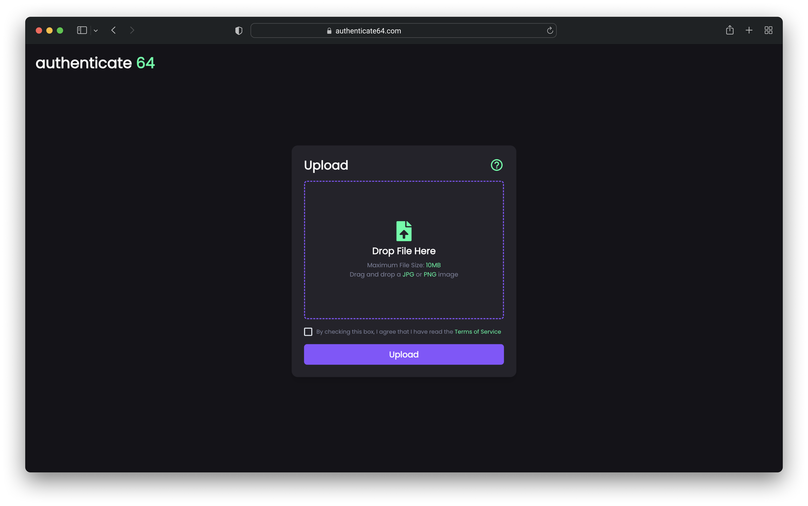

# authenticate 64

# Abstract

The purpose of this project is to see whether a machine learning (ML) model can be trained with a high accuracy to distinguish the difference between real and counterfeit (fake) USA region N64 games based on the backside of the game. If a ML model can be trained effectively on this dataset, to then create an interface for other people to use the model which would aid in reducing the number of counterfeit N64 games in circulation. As a first step, I used images from online marketplaces/social media to create a dataset of real and fake N64 game backsides and augmented the dataset to prevent under/overfitting. I then created and trained the model producing excellent results with a 97.62% validation accuracy. I finally moved to creating a user friendly sleek frontend and an api to connect everything together. This project serves to benefit the general public aswell as fellow programmers to not only see if the N64 games they have are real/fake, but to also show that even image classification between two classes with such minor details to distinguish between is possible on a small dataset.

# Introduction

Despite the first N64 game being released back on June 23rd 1996, running into counterfeit games in circulation on marketplaces like eBay is a common occurence. Most sellers are obvious that they are selling fakes based on quantity available, location of where they are selling from, and lack of images of the backside of the game. Some even go as far as labeling their listing as a "repro" or reproduction. Majority of gamers/collectors are aware of these signs when trying to purchase a game online, however there are many sellers who are selling games that they get from a yard sale or that were in their basement. These sellers are generally unaware of where their games were originally sourced from and they occasionally do sell fakes despite claiming they are "authentic". Most people in this situation of having N64 games from a unknown origin do not know with a high confidence of whether their game is real or fake and they are the target market for this project. 

Lets see some common signs of what the backside of a fake N64 game looks like: 

Now that you know these signs, you're probably looking at this next image thinking it is a real N64 game. Plot twist, it isn't! The signs of it being fake are so subtle that it is easy to fool you.

From this information, it is easy to conclude that the backside of a N64 game is an easy way to tell if the game is real or not since it has several distinguishing features to indicate whether it is real or not. While not foolproof, it is by far the easiest and most reliable method which is why in this project I trained the ML model on a dataset containing images of the backside of both real and fake N64 games. 

# Methods

Trying to find images of the backside of fake N64 games proved challenging and I only managed to come up with 21 images while I had 103 images of real N64 games. To prevent overfitting/underfitting between the classes, I used data augmentation to apply various augmentations to the fake class to bring both classes to 103 images each. To do this, I used the cv2 Python library (Open CV) to apply rotation, flip, brightness/contrast, and blurring augmentations to the fake class. After bringing up the total dataset to 206 images, I split the data into a testing dataset and validation dataset with 164 images and 42 images respectively. In each dataset, the split between the real and fake classes was even, having 82 of each class in the testing dataset and 21 of each class in the validation dataset. After that I started working on the model itself. I used PyTorch to create a Convolutional Neural Network (CNN) that utilizes a pretrained ResNet18 model with all of the pretrained layers frozen except the fully connected layer (which was also replaced). This was done due to having such a small dataset to train/validate with. The model also uses a Stochastic gradient descent (SGD) algorithm as its optimizer. After creating the model training Python module, I moved to creating an api in Python using Flask to load the trained model and evaluate images provided to it. Lastly, I created a frontend using Vite, React, and Chakra UI to allow a sleek modern way to interact with the api.

# Results

The CNN model training was trialed several* times with varying hyperparameters** that deviated from the baseline. The baseline hyperparameters were chosen based on similar CNNs that already have optimized hyperparameters. Below are the most notable trials as the others yielded significantly inferior results. 

The baseline trial had the following hyperparameters:
    
    batchSize=32, numOfEpochs=100, patience=5, learningRate=0.001, momentum=0.9
These hyperparameters yielded the following graphs:

These hyperparameters yielded the following results (based on the last epoch):
    
    Training Loss: 0.05 | Validation Loss: 0.11 | Training Accuracy: 99.39% | Validation Accuracy: 100.0%

In an effort to mitigate the amount of noise in both the loss curve and the accuracy curve, the batch size was increased to 64 from 32 in this trial which yielded the best model***:
    
    batchSize=64, numOfEpochs=100, patience=5, learningRate=0.001, momentum=0.9
These hyperparameters yielded the following graphs:

These hyperparameters yielded the following results (based on the last epoch):
    
    Training Loss: 0.08 | Validation Loss: 0.12 | Training Accuracy: 100% | Validation Accuracy: 97.62%

*Note 1: Because the validation accuracy of the best model is at 97.62%, the graphs look nominal, and the generalization is excellent I deemed that further optimizing the hyperparameters would yield negligible results in comparison to focusing on the methodologies used while training which is why I only did several trials as opposed to using something like a grid search

**Note 2: "hyperparameters" defined in the scope of this project is not including the optimizer or the pretrained model used. While various ones were tested with, the results were so similar that I felt it wasn't significant enough to include in the hyperparameter trials

***Note 3: Although the baseline trial had a better validation loss and validation accuracy for its last epoch, the model's stability is significantly worse which resulted in a fluctuation of loss rates and accuracy rates during training/validation of the baseline trial making these numbers unreliable in comparison with the increased batch size trial

# Conclusions

Overall authenticate64 is a great success with a ML model that has a 97.62% validation accuracy on distinguishing between real and fake USA region N64 games. All of the goals of this project have been met and it is a viable real world solution for consumers to detect whether their N64 games are real or counterfeit. As time goes on, more data regarding fake N64 games will become available and this will allow me to add to the dataset improving the validation accuracy of the model.